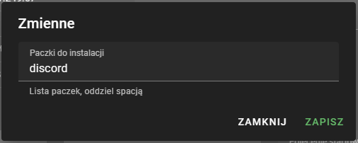

# Jak hostować boty Discord na IVhost

Po zakupieniu odpowiedniego pakietu z kategorii botów Discord należy wgrać pliki bota poprzez zakładkę pliki lub SFTP.
Plik uruchamiający boota musi znajdować się w głównej ścieżce i posiadać nazwę `bot.py` lub `bot.js`.
Po wgraniu plików przechodzimy do zakładki ustawienia i klikamy przycisk zmienne (na dole). Wypisujemy teraz paczki do zainstalowania
oddzielając je spacją.

Po uruchomieniu bota należy również wysłać wiadomość "uruchomiono" co oznaczy bota jako uruchomionego. W Pythonie będzie to
`print("uruchomiono")`, natomiast w JavaScript `console.log("uruchomiono")`.