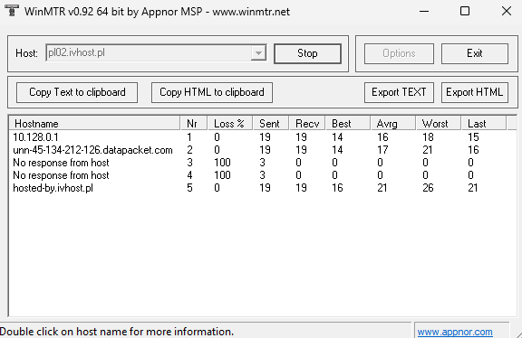

WinMTR to program łączący ze sobą funkcje traceroute i ping. Pokazuje on trasę sieciową pakietów wraz z pingiem na odcinkach
trasy sieciowej.

## Jak używać?
1. Pobierz program WinMTR z <a href="https://winmtr.net" rel="nofollow noopener">tej strony</a> klikając w link o nazwie WinMTR-vxxx.zip.
2. Otwórz archiwum pliku, przejdź do folderu WinMTR, a następnie wybierz wersję x64 i uruchom plik WinMTR.exe
3. W polu Host wpisz adres IP lub nazwę domeny i kliknij przycisk Start.

Po kliknięciu start odczekaj kilka minut i kliknij Stop. Kolumny Best/Avrg/Worst oznaczają ping w kolejności najlepszy, średni i najgorszy.

