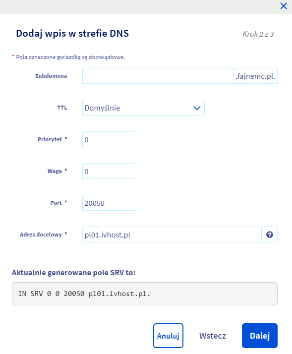

W tym poradniku dowiesz się jak podpiąć domenę do serwera Minecraft. Wykorzystamy do tego typ rekordu SRV, dzięki czemu
możemy bez problemu na domenie równocześnie z serwerem Minecraft mieć np. itemshopa.

## Darmowa subdomena
IVhost oferuje darmową subdomenę ivhs.pl (np. serwer.ivhs.pl). W celu ustawienia subdomeny należy udać się do ustawień
serwera i w polu Subdomena wpisać nazwę serwera. Jeżeli wpiszemy np. dirt to połączymy się z serwerem używając adresu
dirt.ivhs.pl.

## Domena na Cloudflare
Przejdź do panelu Cloudflare i wybierz swoją domenę, a następnie przejdź do zakładki DNS. Kliknij add record, w polu type
wybierz SRV, a w polu name wpisz `_minecraft._tcp`. Priority i weight ustaw na 1, w polu port wpisz główny port, który znajdziesz
w ustawieniach serwera w panelu IVhost. W target wpisz adres połączeniowy serwera (z panelu IVhost, np. pl01.ivhost.pl) bez portu, a następnie kliknij save.

## Domena na OVH
Przejdź do panelu OVH i wybierz domenę, a następnie przejdź do sekcji Strefa DNS w wybranej domenie. Kliknij Dodaj rekord (przycisk po prawej)
i wybierz SRV. Pole subdomena pozostaw puste, a TTL domyślne. W polach priorytet i waga wpisz 0, w polu port wpisz port
główny serwera. W adresie docelowym wpisz adres połączeniowy serwera (z panelu IVhost, np. pl01.ivhost.pl) bez portu. Po 
poprawnym uzupełnieniu formularza kliknij dalej, następnie zatwierdź.

## Domena na Home
Przejdź do panelu Home, przy wybranej domenie w działania kliknij zarządzaj rekordami DNS. Teraz dodaj nowy rekord,
typ rekordu ustaw na SRV, w polu usługa wpisz `_minecraft`, protokół pozostaw na `_tcp`. Priorytet i waga mogą pozostać
niezmienne, w polu adres hosta wpisz adres połączeniowy serwera (z panelu IVhost, np. pl01.ivhost.pl) bez portu. W polu numer portu wpisz port
główny serwera, opcji TTL nie zmieniaj. Po poprawnym uzupełnieniu pól kliknij OK - rekord powinien zostać dodany.

!!!
Propagacja DNS zajmuje zazwyczaj do ok. kilku godzin - oznacza to, że domena może zacząć działać dopiero jakiś czas po
jej poprawnym skonfigurowaniu.
!!!