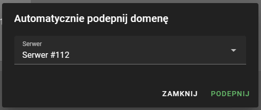

## Darmowa subdomena
IVhost oferuje darmową subdomenę ivhs.pl (np. serwer.ivhs.pl). W celu ustawienia subdomeny należy udać się do ustawień
serwera i w polu Subdomena wpisać nazwę serwera. Jeżeli wpiszemy np. dirt to połączymy się z serwerem używając adresu
dirt.ivhs.pl.
## Domena z IVhost
IVhost w swojej ofercie posiada również domeny. Jeżeli posiadasz domenę zakupioną na IVhost udaj się do jej ustawień
i wybierz opcję automatyczne podłączanie. Teraz wybierz swój serwer z listy serwerów i kliknij podłącz. W ten sposób
domena została automatycznie podpięta do Twojego serwera. Pamiętaj, że zmiana rekordów DNS może potrwać do godziny.

## Domena z Cloudflare
Przejdź do panelu Cloudflare i wybierz swoją domenę, a następnie przejdź do zakładki DNS. Kliknij add record, w polu type
wybierz SRV, a w polu name wpisz `_minecraft._tcp`. Priority i weight ustaw na 1, w polu port wpisz główny port, który znajdziesz
w ustawieniach serwera w panelu IVhost. W target wpisz adres połączeniowy (z panelu IVhost) serwera bez portu, a następnie kliknij save.
