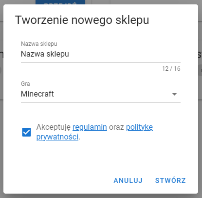
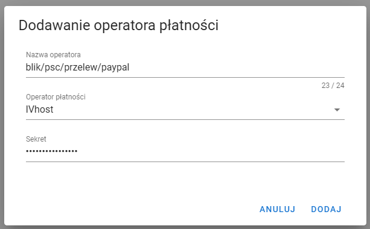
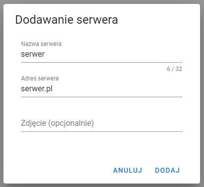

# Jak zrobić itemshop Minecraft
IVhost posiada integrację z darmowym, rozbudowanym itemshopem Minecraft [VIshop.pl](https://vishop.pl). W tym poradniku
dowiesz się jak zrobić własny itemshop Minecraft z płatnościami IVhost. Wszystkie pieniądze z itemshopa będą trafiać
na Twój wirtualny portfel IVhost.

## Zakładanie itemshopu
Przechodzimy na stronę VIshop.pl i logujemy się poprzez platformę Discord - jest to w pełni bezpieczne. Po zalogowaniu się
przechodzimy do zakładki panel (prawy górny róg) i klikamy utwórz nowy sklep. Uzupełniamy teraz informacje o naszym sklepie
i wybieramy grę Minecraft oraz akceptujemy regulamin i klikamy stwórz.

Po utworzeniu sklepu wybieramy go z listy sklepów i klikamy przejdź. 

### Dodawanie płatności IVhost
Przechodzimy do zakładki operatorzy płatności, klikamy dodaj operatora płatności. W nazwie operatora wpisujemy np. "blik/psc/przelew/paypal" 
albo po prostu IVhost. Z listy operatorów płatności w polu operator płatności wybieramy IVhost. Przechodzimy teraz do panelu 
IVhost, do zakładki konto. W oknie z tajnym kluczem klikamy wygeneruj nowy klucz jeżeli nie jest jeszcze wygenerowany, 
a następnie klikamy skopiuj klucz. Wracamy teraz do panelu VIshop i w polu sekret (po wybraniu operatora IVhost) wklejamy
skopiowany klucz i klikamy dodaj.

### Dodawanie serwerów na itemshop
Przechodzimy teraz do zakładki serwery i klikamy utwórz nowy serwer. Wpisujemy nazwę serwera oraz adres przez który 
łączymy się przez serwer, zdjęcie jest opcjonalne. Po uzupełnieniu informacji o serwerze klikamy dodaj.

### Dodawanie produktów w itemshopie
Przechodzimy do zakładki produkty i uzupełniamy wszystko zgodnie z podanymi w formularzu informacjami. Poradnik jak
dodać zdjęcie znajdziesz pod [tym linkiem](https://wiki.vishop.pl/zdjecia/). Na samym dole wpisujemy ceny, tam też trzeba
wpisać cenę dla dodanego operatora IVhost.

### Wgrywanie pluginu VIshop na serwer
Do poprawnego działania sklepu konieczne jest wgranie pluginu VIshop na serwer. Szczegółowy poradnik jak to zrobić znajdziesz
pod [tym linkiem](https://wiki.vishop.pl/plugin/).

### Pomoc z itemshopem
W przypadku problemów lub pytań napisz na [serwerze Discord IVhost](https://discord.gg/M3Xc6P6ess) lub na [serwerze Discord VIshop](https://discord.gg/McGwsEsjBU).