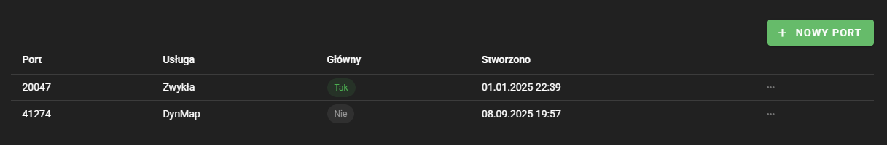

IVhost oferuje dodatkowe porty dla serwerów Minecraft. W celu dodania portów należy przejść do wybranego serwera, a następnie 
zakładki ustawienia i kliknąć ikonę zębatki obok portów. W tym miejscu znajduje się lista portów wraz z możliwością ich
dodawania usuwania, ustawiania jako główny.

## Typy portów
Do wyboru są różne typy portów, standardowy to typ zwykły. Inne typy zgodnie z nazwą są przeznaczone do różnych rzeczy,
np. typ voice chat do użycia w pluginach lub modach na voice chat na serwerze Minecraft. Typ portu zewnętrzne proxy wymagany jest
w trybach w sytuacji, gdy proxy nie jest hostowane na IVhost.