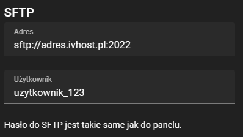

## Pobranie odpowiedniego programu
Do połączenia się przez SFTP do serwera potrzebny jest odpowiedni program. W tym poradniku zostanie wykorzystany
jeden z najpopularniejszych klientów FTP, czyli <a href="https://filezilla-project.org/" rel="nofollow noopener">FileZilla</a>. 
Przechodzimy na podlinkowaną stronę programu i pobieramy, po czym instalujemy program.

## Połączenie do SFTP
Dane potrzebne do połączenia znajdziesz w panelu (IVhost) serwera, w zakładce ustawienia. Każdy serwer i użytkownik posiada
inne dane potrzebne do połączenia SFTP.

Kopiujemy pole adres i wklejamy
w programie FileZilla w polu serwer. Analogicznie robimy z nazwą użytkownika, kopiujemy ją z pola użytkownik i wklejamy
w polu nazwa użytkownika. Hasłem do SFTP jest hasło do konta IVhost. Port pozostawiamy pusty, ponieważ jest on już podany
w polu serwer. 

Po uzupełnieniu danych klikamy szybkie połączenie, jeżeli dane zostały uzupełnione poprawnie zostaniemy
połączeni z SFTP.