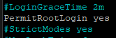

# Jak odblokować roota na Ubuntu
W celu odblokowania możliwości połączenia się przez SSH na konto root (używając hasła) wpisujemy polecenie `sudo nano /etc/ssh/sshd_config`, 
następnie szukamy linijki `#PermitRootLogin prohibit-password`i usuwamy z niej znak #, a prohibit-password zmieniamy na yes. 
Finalnie ta linijka powinna wyglądać w następujący sposób:

Zapisujemy plik skrótem ctrl+s, a następnie wychodzimy z niego poprzez kombinację ctrl+x i wpisujemy polecenie `systemctl restart ssh`.

Teraz musimy ustawić hasło roota, zrobimy to poleceniem `sudo passwd root`. Po wpisaniu polecenia wpisujemy hasło, podczas
wpisywania hasła ze względów bezpieczeństwa nie widać. Po poprawnym wykonaniu wszystkich kroków powinieneś móc się zalogować
na roota przez SSH używając ustawionego hasła.